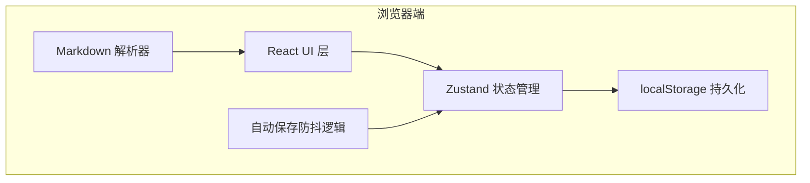
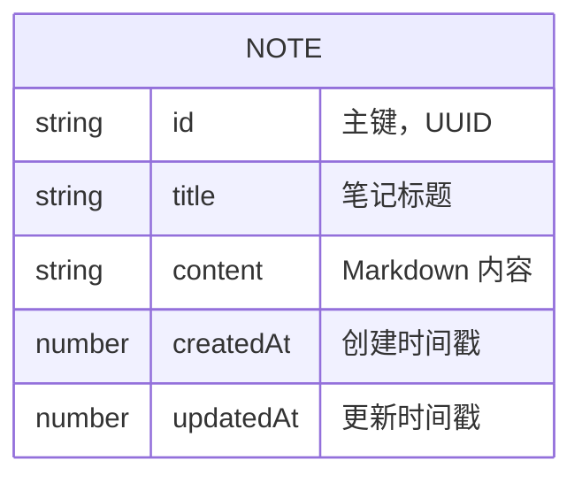

## 1. 架构设计

纯前端单页应用，无后端服务，数据完全存储在浏览器 localStorage 中。



## 2. 技术描述

- **前端框架**：React@18 + TypeScript
- **构建工具**：Vite@5
- **样式方案**：Tailwind CSS@3
- **状态管理**：Zustand（轻量级，适合本地状态）
- **Markdown 解析**：marked（轻量 Markdown 解析器） + highlight.js（代码高亮）
- **图标库**：lucide-react
- **数据存储**：浏览器 localStorage

## 3. 目录结构

```
src/
├── components/
│   ├── NoteList.tsx      # 左侧笔记列表
│   ├── NoteEditor.tsx    # Markdown 编辑器
│   ├── NotePreview.tsx   # 实时预览渲染
│   └── Splitter.tsx      # 可拖拽分割线
├── hooks/
│   ├── useAutoSave.ts    # 自动保存防抖 Hook
│   └── useLocalStorage.ts # localStorage 操作 Hook
├── store/
│   └── useNoteStore.ts   # Zustand 笔记状态管理
├── utils/
│   └── markdown.ts       # Markdown 解析工具
├── types/
│   └── note.ts           # 类型定义
├── App.tsx               # 主应用组件
├── main.tsx              # 入口文件
└── index.css             # 全局样式
```

## 4. 路由定义

| 路由 | 用途 |
|-------|---------|
| `/` | 主页面，包含笔记列表、编辑器和预览区 |

## 5. 数据模型

### 5.1 数据模型定义



### 5.2 类型定义

```typescript
interface Note {
  id: string;
  title: string;
  content: string;
  createdAt: number;
  updatedAt: number;
}

interface NoteStore {
  notes: Note[];
  activeNoteId: string | null;
  addNote: () => void;
  deleteNote: (id: string) => void;
  updateNote: (id: string, content: string) => void;
  setActiveNote: (id: string) => void;
}
```

### 5.3 localStorage 存储格式

- **Key**: `markdown-notes-app`
- **Value**: JSON 字符串，包含 notes 数组和 activeNoteId

```json
{
  "notes": [
    {
      "id": "uuid-1",
      "title": "欢迎使用",
      "content": "# 欢迎使用 Markdown 笔记\n\n这是你的第一篇笔记。",
      "createdAt": 1234567890,
      "updatedAt": 1234567890
    }
  ],
  "activeNoteId": "uuid-1"
}
```

## 6. 核心技术方案

### 6.1 自动保存机制

- 使用 `useAutoSave` Hook，监听编辑器内容变化
- 防抖延迟：500ms（避免频繁写入）
- 额外监听 `beforeunload` 事件，确保页面关闭前保存
- 切换笔记时立即保存当前笔记

### 6.2 Markdown 解析

- 使用 `marked` 库解析 Markdown 语法
- 支持语法：标题（#）、加粗（**）、斜体（*）、有序/无序列表、链接（[text](url)）、图片（）、代码块（```）
- 使用 `highlight.js` 实现代码块语法高亮
- 配置 `marked` 开启代码高亮钩子

### 6.3 性能优化

- Markdown 解析防抖：300ms 延迟，避免输入卡顿
- 预览区使用 `React.memo` 包裹，仅在内容变化时重新渲染
- localStorage 读写合并，减少 I/O 操作

## 7. 依赖包

```json
{
  "dependencies": {
    "react": "^18.2.0",
    "react-dom": "^18.2.0",
    "zustand": "^4.5.0",
    "marked": "^12.0.0",
    "highlight.js": "^11.9.0",
    "lucide-react": "^0.344.0"
  },
  "devDependencies": {
    "@types/react": "^18.2.0",
    "@types/react-dom": "^18.2.0",
    "@vitejs/plugin-react": "^4.2.0",
    "autoprefixer": "^10.4.0",
    "postcss": "^8.4.0",
    "tailwindcss": "^3.4.0",
    "typescript": "^5.3.0",
    "vite": "^5.1.0"
  }
}
```
